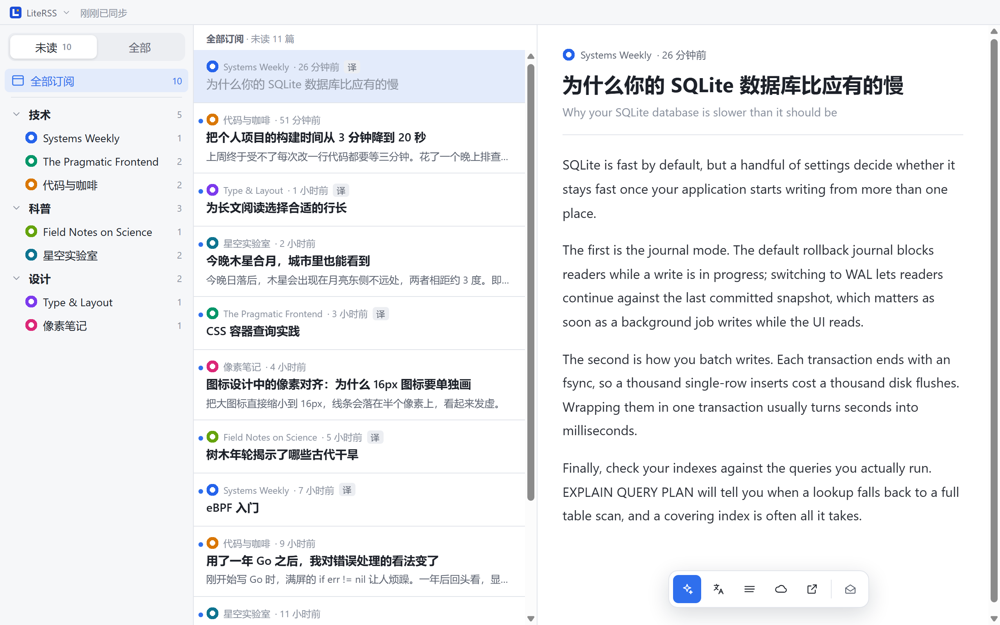
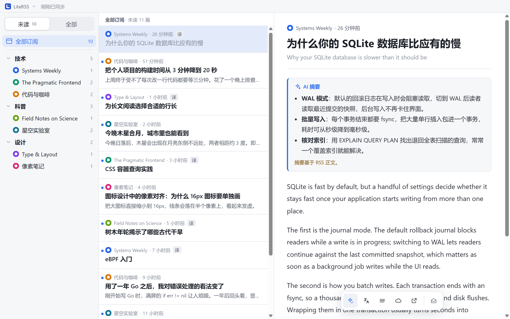
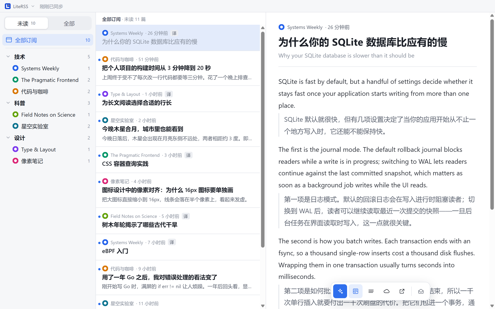

<div align="center">


# LiteRSS

一个简洁的 FreshRSS 桌面阅读器

[](https://github.com/Mistakey/LiteRSS/releases/latest)
[](https://github.com/Mistakey/LiteRSS/releases/latest)
[](LICENSE)

</div>

<picture>
  <source media="(prefers-color-scheme: dark)" srcset="docs/images/main-dark.png">
  
</picture>

## 简介

LiteRSS 是我给自己写的 RSS 阅读器，开源出来给有同样需求的人用。它连接你自己的 [FreshRSS](https://freshrss.org/)，
专注于把未读文章读完：英文标题直接显示中文，英文文章可以一键出摘要或中英对照，读过的自动标为已读并同步回 FreshRSS。

它刻意保持简单：只有每天真的会用到的功能，没有收藏夹、没有本地订阅管理、没有插件和统计。订阅、分类都在 FreshRSS 里管理，
LiteRSS 只负责舒服地读。

## ✨ 功能

**📚 阅读**

- 三栏界面：订阅（按分类，带网站图标和未读数）、文章列表、正文
- 「未读 / 全部」两种视图；本地保留 90 天内的文章，可以回头翻
- 英文标题在列表里显示中文译文（百度翻译），原标题在正文顶部
- RSS 只给了摘要时，一键抓取原文全文
- 在浏览器打开原文，方便剪藏或细读

**🤖 英文文章**

- **AI 摘要**：用你配置的 OpenAI 兼容模型，生成中文要点摘要
- **中英对照**：整篇按段落翻译，原文与译文交替显示，再点一下回到原文
- **Bionic Reading**：可选加粗英文单词开头，读英文更快

**✅ 已读与同步**

- 点开即已读；单篇可以标回未读
- 源、分类或全部「全部标为已读」，以及「此篇及以上 / 以下标为已读」，误操作几秒内可撤销
- 已读状态双向同步：你在别处读掉的文章，这里也会消失；LiteRSS 不会把它们改回未读

**🖥️ 桌面体验**

- 跟随系统的浅色 / 深色主题
- 托盘常驻、关闭到托盘、开机自启、记住窗口位置
- 有新版本时在应用内一键更新（自动下载、校验、安装并重启）

**🔒 隐私**

- 没有任何统计与遥测，不加载外部字体或脚本
- 正文里的脚本一律不执行；密码与密钥加密保存

## 📸 截图

| AI 摘要 | 中英对照 |
| :---: | :---: |
|  |  |

## 📦 安装

从 [Releases](https://github.com/Mistakey/LiteRSS/releases/latest) 下载对应的安装包：

| 系统 | 文件 |
| --- | --- |
| Windows 安装版 | `LiteRSS-<版本>-windows-amd64-installer.exe`（ARM 设备选 `arm64`） |
| Windows 便携版 | `LiteRSS-<版本>-windows-amd64-portable.zip`，解压即用 |
| macOS | `LiteRSS-<版本>-darwin-universal.dmg`（Intel 与 Apple 芯片通用） |

Windows 安装版按当前用户安装，不需要管理员权限。之后的新版本在应用里点「更新」即可；便携版需要到发布页手动下载。

## ⚙️ 配置

首次启动后，点左上角的「LiteRSS」→「设置…」：

1. **FreshRSS**（必填）：服务器地址、用户名和 API 密码。API 密码在 FreshRSS 的「个人资料 → API 管理」里设置，不是登录密码。
2. **标题翻译**（可选）：百度翻译开放平台的 App ID 与密钥，用于把英文标题译成中文。
3. **大模型**（可选）：任意 OpenAI 兼容接口的地址、模型名和密钥，用于摘要和全文翻译。
4. **网络代理**（可选）：跟随系统、不用代理或手动指定。

不填可选项也能正常阅读。

> [!IMPORTANT]
> FreshRSS 默认会清理旧的未读文章：抓取超过 3 个月、或每个订阅源超过 200 篇的文章，即使没读也会被删除，
> LiteRSS 随之也看不到它们。想保留积压的未读，请在 FreshRSS 的归档设置里勾选保留未读，或调大保留期限和数量。

数据保存在：

- Windows：`%APPDATA%\LiteRSS\`
- macOS：`~/Library/Application Support/LiteRSS/`
- 便携版：程序旁的 `data\` 文件夹

## 🛠️ 从源码构建

需要 Go（版本见 `go.mod`）、Node.js 24、[Task](https://taskfile.dev/) 和同版本的 Wails v3 CLI，详见 [构建依赖](docs/BUILD_REQUIREMENTS.md)。

```bash
cd frontend && npm install && cd ..
go install github.com/wailsapp/wails/v3/cmd/wails3@v3.0.0-beta.26
task build      # 产物在 build/bin/
task package    # 打安装包
```

直接 `go build` 得到的是开发构建，使用独立的数据目录，不会影响已安装的 LiteRSS。
开发与测试说明见 [AGENTS.md](AGENTS.md) 和 [测试指南](docs/TESTING.md)，版本变化见 [CHANGELOG](CHANGELOG.md)。

## 🙏 致谢

LiteRSS 最初 fork 自 [MrRSS](https://github.com/WCY-dt/MrRSS)，之后按自己的使用习惯重写成了现在的样子。
感谢 [@WCY-dt](https://github.com/WCY-dt) 和 MrRSS 的所有贡献者，没有 MrRSS 就没有这个项目。
如果你想要一个功能更全面、自带订阅管理的 RSS 阅读器，推荐直接使用 MrRSS。

## 📄 许可证

[GPL-3.0](LICENSE)，与 MrRSS 相同。
